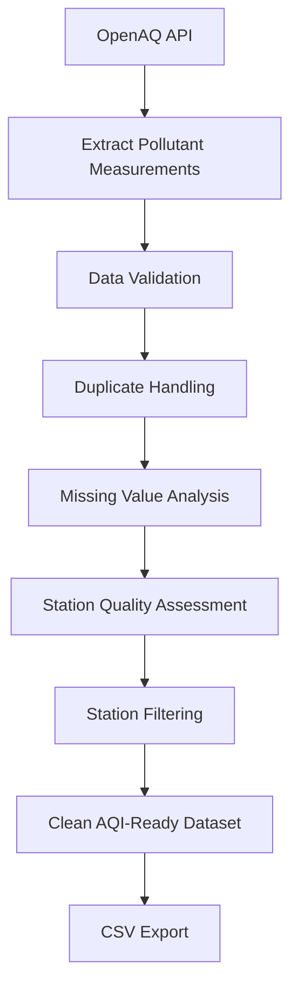

# Air Quality Data Engineering Pipeline using OpenAQ API and Python

## Overview

This project demonstrates an end-to-end ETL (Extract, Transform, Load) pipeline for collecting, cleaning, validating, and preparing air quality monitoring data from the OpenAQ API.

The pipeline ingests pollutant measurements from multiple monitoring stations in Hyderabad, applies data quality checks, handles missing and duplicate records, filters unreliable stations, and generates a forecasting-ready dataset for downstream analytics and machine learning applications.

---

## Problem Statement

Raw environmental datasets often contain:

- Missing pollutant measurements
- Duplicate records
- Inconsistent station coverage
- Data quality issues

These challenges can negatively impact analytics and forecasting models.

This project focuses on building a reliable data engineering pipeline to transform raw pollutant measurements into a clean and analysis-ready dataset.

---

## Project Objectives

- Collect air quality data from OpenAQ API
- Build an automated extraction workflow
- Clean and validate pollutant measurements
- Assess station-level data quality
- Filter low-quality monitoring stations
- Create a curated dataset for AQI analysis and forecasting

---

## ETL Architecture

---

## Dataset Information

### Pollutants Collected

- PM2.5
- PM10
- NO₂
- SO₂
- CO
- O₃

### Location

Hyderabad Monitoring Stations

## Data Source

- This project uses publicly available air quality data obtained through the OpenAQ API.

- `Source: https://openaq.org`

- Data ownership remains with the original data providers and OpenAQ.
  

---

## Data Transformation Steps

### 1. Data Extraction

- Connected to OpenAQ API
- Retrieved pollutant measurements
- Processed API responses
- Consolidated station-level records

### 2. Data Cleaning

- Removed invalid measurements
- Standardized pollutant names
- Corrected data inconsistencies
- Handled duplicate observations

### 3. Data Quality Assessment

Calculated:

- Missing value percentages
- Station coverage statistics
- Pollutant availability

### 4. Station Selection

Applied quality thresholds to retain stations with reliable pollutant coverage.

### 5. Dataset Preparation

Generated a clean station-level dataset suitable for:

- AQI calculation
- Time series forecasting
- Environmental analytics
- Machine learning applications

---

## Technologies Used

- Python
- Pandas
- NumPy
- Requests
- OpenAQ API
- Jupyter Notebook

---

## Project Deliverables

- Raw pollutant dataset
- Cleaned dataset
- Data quality report
- Station evaluation report
- AQI-ready dataset

---

## Key Learnings

- API-based data ingestion
- ETL pipeline development
- Data quality assessment
- Environmental data engineering
- Dataset preparation for forecasting projects

---

## Future Improvements

- Automated daily ingestion
- Incremental data loading
- Data versioning
- Airflow orchestration
- Cloud deployment
- Data warehouse integration

---

## Author

Sai Subba Rao Mahendrakar

